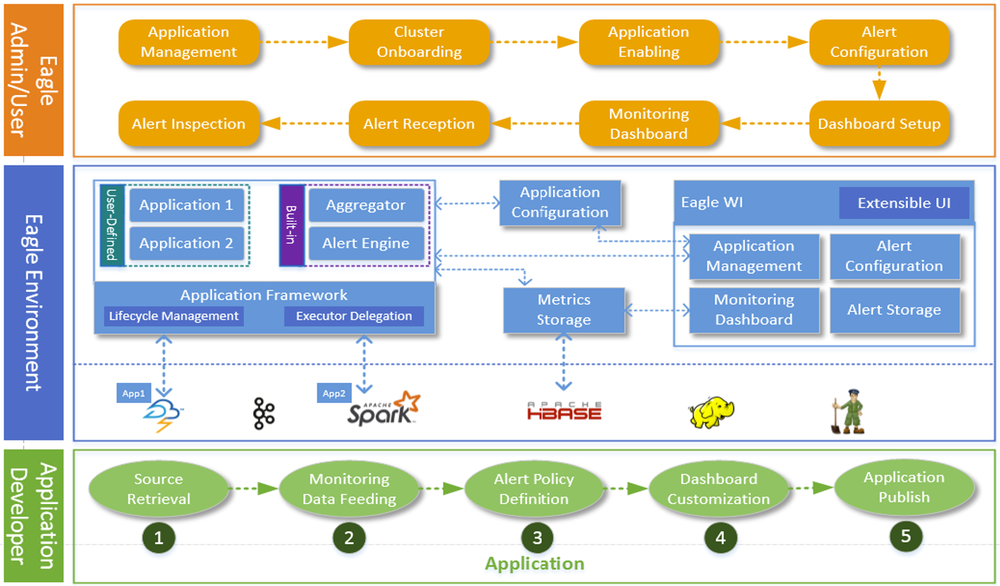
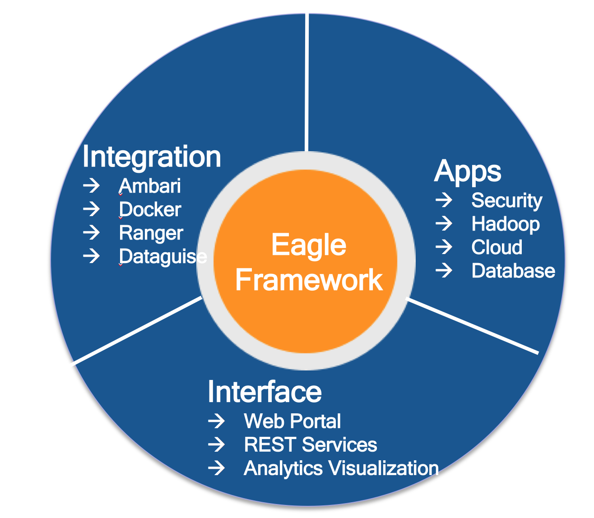

# Architecture

## Overview

## Ecosystem

### Eagle Framework

Eagle has multiple distributed real-time frameworks for efficiently developing highly scalable monitoring applications.

* Alert Engine

`Placeholder for topic: Alert Engine`

* Storage Engine

`Placeholder for topic: Storage Engine`

* Application Framework

`Placeholder for topic: Application Framework`

* UI Framework

`Placeholder for topic: UI Framework`

### Eagle Apps

* Security/ Hadoop/ Operational Intelligence / …. For see more applications, see [Applications](applications).

### Eagle Interface

* REST Service / Management UI / Customizable Analytics Visualization

### Eagle Integration

* Ambari / Docker / Ranger / Dataguise

---

# Concepts

* Here are some terms we are using in Apache Eagle (incubating, called Eagle in the following), please check them for your reference. They are basic knowledge of Eagle which also will help to well understand Eagle.

## Site

* A site can be considered as a physical data center. Big data platform e.g. Hadoop may be deployed to multiple data centers in an enterprise.

## Application

* An "Application" or "App" is composed of data integration, policies and insights for one data source.

## Application Descriptor

* An "Application Descriptor" is a static packaged metadata information consist of:

    * **Basic information**: type, name, version, description.

    * **Application**: the application process to run.

    * **Configuration Descriptor**:  describe the configurations required by the application when starting like name, displayName, defaultValue Description, required, etc. which will automatically be visualized in configuration editor.

    * **Streams**: the streams schema the application will export.

    * **Docs**: application specific documentations which will be embedded in necessary area during the whole lifecyle of application management.

    * **Sample**: ApplicationDesc of JPM_WEB_APP

            {
                type: "JPM_WEB_APP",
                name: "Job Performance Monitoring Web ",
                version: "0.5.0-incubating",
                description: null,
                appClass: "org.apache.eagle.app.StaticApplication",
                jarPath: "/opt/eagle/0.5.0-incubating-SNAPSHOT-build-20161103T0332/eagle-0.5.0-incubating-SNAPSHOT/lib/eagle-topology-0.5.0-incubating-SNAPSHOT-hadoop-2.4.1-11-assembly.jar",
                viewPath: "/apps/jpm",
                providerClass: "org.apache.eagle.app.jpm.JPMWebApplicationProvider",
                configuration: {
                    properties: [{
                        name: "service.host",
                        displayName: "Eagle Service Host",
                        value: "localhost",
                        description: "Eagle Service Host, default: localhost",
                        required: false
                    }, {
                        name: "service.port",
                        displayName: "Eagle Service Port",
                        value: "8080",
                        description: "Eagle Service Port, default: 8080",
                        required: false
                    }]
                },
                streams: null,
                docs: null,
                executable: false,
                dependencies: [{
                    type: "MR_RUNNING_JOB_APP",
                    version: "0.5.0-incubating",
                    required: true
                }, {
                    type: "MR_HISTORY_JOB_APP",
                    version: "0.5.0-incubating",
                    required: true
                }]
            }

## Application Provider

* An "application provider" in fact is a package management and loading mechanism leveraging [Java SPI](https://docs.oracle.com/javase/tutorial/ext/basics/spi.html).

* For example, in file `META-INF/services/org.apache.eagle.app.spi.ApplicationProvider`, place the full class name of an application provider:

        org.apache.eagle.app.jpm.JPMWebApplicationProvider

## Policy

* A "Policy" defines the rule to alert. Policy can be simply a filter expression or a complex window based aggregation rules etc.

## Alerts

* An "Alert" is an real-time event detected with certain alert policy or correlation logic, with different severity levels like INFO/WARNING/DANGER.

## Data Source

* A "Data Source" is a monitoring target data. Eagle supports many data sources HDFS audit logs, Hive2 query, MapReduce job etc.

## Stream

* A "Stream" is the streaming data from a data source. Each data source has its own stream.

---

# Quick Start

## Deployment

### Prerequisites

Eagle requires the following dependencies:

* For streaming platform dependencies
    * Storm: 0.9.3 or later
    * Hadoop: 2.6.x or later
    * Hbase: 0.98.x or later
    * Kafka: 0.8.x or later
    * Zookeeper: 3.4.6 or later
    * Java: 1.8.x
* For metadata database dependencies (Choose one of them)
    * MangoDB 3.2.2 or later
        * Installation is required
    * Mysql 5.1.x or later
        * Installation is required

Notice:  
>     Storm 0.9.x does NOT support JDK8. You can replace asm-4.0.jar with asm-all-5.0.jar in the storm lib directory. 
>     Then restart other services(nimbus/ui/supervisor). 

### Installation

##### Build Eagle

* Download the latest version of Eagle source code.

        git clone https://github.com/apache/incubator-eagle.git
        
* Build the source code, and a tar.gz package will be generated under eagle-server-assembly/target

        mvn clean install -DskipTests.
        
##### Deploy Eagle
* Copy binary package to your server machine. In the package, you should find:
    * bin/: scripts used for start eagle server
    * conf/: default configurations for eagle server setup.
    * lib/ : all included software packages for eagle server
* Change configurations under conf/
	* eagle.conf
    * server.yml
* Run eagle-server.sh
    * ./bin/eagle-server.sh start
* Check eagle server
    * In your web browser, visit http://host:port/

## Setup Your Monitoring Case
`Placeholder for topic: Setup Your Monitoring Case`
